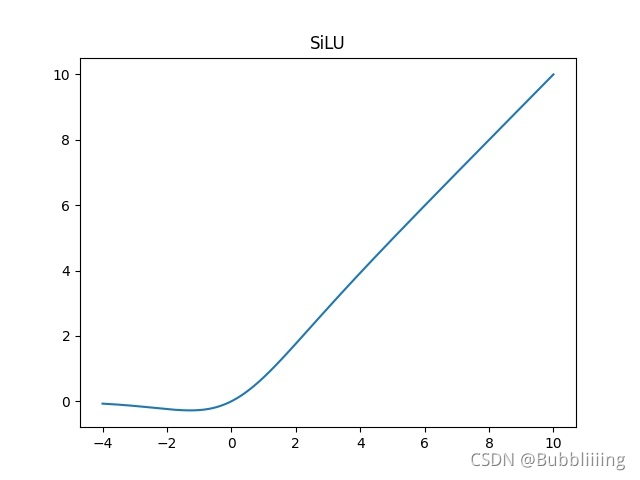

# yolo预测步骤


##  传统yolo


# 源码下载

https://github.com/bubbliiiing/yolox-pytorch
 喜欢的可以点个star噢。


# YoloX改进的部分（不完全）

### 1、Focus网络结构

**主干部分：使用了Focus网络结构，这个结构是在YoloV5里面使用到比较有趣的网络结构，具体操作是在一张图片中每隔一个像素拿到一个值，这个时候获得了四个独立的特征层，然后将四个独立的特征层进行堆叠，此时宽高信息就集中到了通道信息，输入通道扩充了四倍。**


### 2、分类回归层

**分类回归层：Decoupled  Head，以前版本的Yolo所用的解耦头是一起的，也就是分类和回归在一个1X1卷积里实现，YoloX认为这给网络的识别带来了不利影响。在YoloX中，Yolo Head被分为了两部分，分别实现，最后预测的时候才整合在一起。**


### 3、数据增强：Mosaic数据增强

**数据增强：Mosaic数据增强、Mosaic利用了四张图片进行拼接实现数据中增强，根据论文所说其拥有一个巨大的优点是丰富检测物体的背景！且在BN计算的时候一下子会计算四张图片的数据！**


### 4、Anchor Free：不使用先验框


### 5、SimOTA ：为不同大小的目标动态匹配正样本。


以上并非全部的改进部分，还存在一些其它的改进，这里只列出来了一些我比较感兴趣，而且非常有效的改进。

# YoloX实现思路

## 一、整体结构解析


在学习YoloX之前，我们需要对YoloX所作的工作有一定的了解，这有助于我们后面去了解网络的细节。

**和之前版本的Yolo类似，整个YoloX可以依然可以分为三个部分，分别是CSPDarknet，FPN以及Yolo Head**。

**CSPDarknet可以被称作YoloX的主干特征提取网络**，输入的图片首先会在CSPDarknet里面进行**特征提取**，提取到的特征可以被称作特征层，**是输入图片的特征集合**。在主干部分，我们**获取了三个特征层**进行下一步网络的构建，这三个特征层我称它为**有效特征层**。

**FPN可以被称作YoloX的加强特征提取网络**，在主干部分获得的三个**有效特征层**会在这一部分进行特征融合，特征融合的目的是结合不同尺度的特征信息。在FPN部分，已经获得的**有效特征层**被用于继续提取特征。**在YoloX里面同样使用了YoloV4中用到的Panet的结构，我们不仅会对特征进行上采样实现特征融合，还会对特征再次进行下采样实现特征融合。**

**Yolo Head是YoloX的分类器与回归器**，通过CSPDarknet和FPN，我们已经可以获得三个加强过的有效特征层。每一个特征层都有宽、高和通道数，此时我们可以将**特征图看作一个又一个特征点的集合**，**每一个特征点都有通道数个特征**。Yolo Head实际上所做的工作就是**对特征点进行判断**，判断**特征点是否有物体与其对应**。以前版本的Yolo所用的解耦头是一起的，也就是分类和回归在一个1X1卷积里实现，YoloX认为这给网络的识别带来了不利影响。在YoloX中，Yolo Head被分为了两部分，分别实现，最后预测的时候才整合在一起。

因此，整个YoloX网络所作的工作就是 **特征提取-特征加强-预测特征点对应的物体情况**。

## 二、网络结构解析

### 1、主干网络CSPDarknet介绍


YoloX所使用的主干特征提取网络为CSPDarknet，它具有五个重要特点：

1、使用了**残差网络Residual**，CSPDarknet中的残差卷积可以分为两个部分，主干部分是一次1X1的卷积和一次3X3的卷积；残差边部分不做任何处理，直接将主干的输入与输出结合。**整个YoloX的主干部分都由残差卷积构成**：

> nets/darknet.py

```python
#--------------------------------------------------#
#   残差结构的构建，小的残差结构
#   在这里通道和宽高都不变
#   两层卷积 1x1和3x3
#--------------------------------------------------#
class Bottleneck(nn.Module):
    # Standard bottleneck
    def __init__(self, in_channels, out_channels, shortcut=True, expansion=0.5, depthwise=False, act="silu",):
        super().__init__()
        hidden_channels = int(out_channels * expansion) # 中间通道减少一半
        Conv = DWConv if depthwise else BaseConv
        #--------------------------------------------------#
        #   利用1x1卷积进行通道数的缩减。缩减率一般是50%
        #--------------------------------------------------#
        self.conv1 = BaseConv(in_channels, hidden_channels, 1, stride=1, act=act)
        #--------------------------------------------------#
        #   利用3x3卷积进行通道数的拓张。并且完成特征提取
        #--------------------------------------------------#
        self.conv2 = Conv(hidden_channels, out_channels, 3, stride=1, act=act)

        # 只有使用残差且 in_channels == out_channels 时才使用残差模块
        self.use_add = shortcut and in_channels == out_channels

    def forward(self, x):
        y = self.conv2(self.conv1(x))
        if self.use_add:
            y = y + x
        return y
```


残差网络的特点是**容易优化**，并且能够通过增加相当的**深度来提高准确率**。其内部的**残差块使用了跳跃连接，缓解了在深度神经网络中增加深度带来的梯度消失问题。**

2、使用**CSPnet**网络结构，CSPnet结构并不算复杂，就是将原来的残差块的堆叠进行了一个拆分，拆成左右两部分：**主干部分继续进行原来的残差块的堆叠**；**另一部分则像一个残差边一样，经过少量处理直接连接到最后。**因此可以认为**CSP中存在一个大的残差边。**


> nets/darknet.py

```python
#--------------------------------------------------------------------#
#   CSPdarknet的结构块,每个stage的结构
#
#   CSPnet结构并不算复杂，就是将原来的残差块的堆叠进行了一个拆分，拆成左右两部分:
#   主干部分继续进行原来的残差块的堆叠；
#   另一部分则像一个残差边一样，经过少量处理直接连接到最后。
#   因此可以认为CSP中存在一个大的残差边。
#
#   V4中先进行了一次卷积让通道翻倍,宽高减半,这里没有做,而是分出去做了,直接就是分为两个分支了,所以最终宽高不变,维度也不变
#--------------------------------------------------------------------#
class CSPLayer(nn.Module):
    def __init__(self, in_channels, out_channels, n=1, shortcut=True, expansion=0.5, depthwise=False, act="silu",):
        #                                       Res次数, shortcut
        super().__init__()
        # 两个分支中间维度缩减一半
        hidden_channels = int(out_channels * expansion)

        #--------------------------------------------------#
        #   右侧: 主干部分的初次卷积 1x1Conv
        #--------------------------------------------------#
        self.conv1  = BaseConv(in_channels, hidden_channels, 1, stride=1, act=act)
        #--------------------------------------------------#
        #   根据循环的次数构建上述Bottleneck残差结构
        #--------------------------------------------------#
        module_list = [Bottleneck(hidden_channels, hidden_channels, shortcut, 1.0, depthwise, act=act) for _ in range(n)]
        self.m      = nn.Sequential(*module_list)

        #--------------------------------------------------#
        #   左侧: 大的残差边部分的初次卷积(只有一次1x1Conv)
        #--------------------------------------------------#
        self.conv2  = BaseConv(in_channels, hidden_channels, 1, stride=1, act=act)

        #-----------------------------------------------#
        #   最终: 对堆叠的结果进行卷积的处理 1x1Conv
        #-----------------------------------------------#
        self.conv3  = BaseConv(2 * hidden_channels, out_channels, 1, stride=1, act=act)

    def forward(self, x):
        #-------------------------------#
        #   x_1是主干部分
        #-------------------------------#
        x_1 = self.conv1(x)
        #-----------------------------------------------#
        #   主干部分利用残差结构堆叠继续进行特征提取
        #-----------------------------------------------#
        x_1 = self.m(x_1)

        #-------------------------------#
        #   x_2是大的残差边部分
        #-------------------------------#
        x_2 = self.conv2(x)

        #-----------------------------------------------#
        #   主干部分和大的残差边部分进行堆叠
        #-----------------------------------------------#
        x = torch.cat((x_1, x_2), dim=1)
        #-----------------------------------------------#
        #   对堆叠的结果进行卷积的处理
        #-----------------------------------------------#
        return self.conv3(x)
```

3、使用了Focus网络结构，这个网络结构是在YoloV5里面使用到比较有趣的网络结构，具体操作是在一张图片中每隔一个像素拿到一个值，这个时候获得了四个独立的特征层，然后将四个独立的特征层进行堆叠，此时宽高信息就集中到了通道信息，输入通道扩充了四倍。拼接起来的特征层相对于原先的三通道变成了十二个通道，下图很好的展示了Focus结构，一看就能明白。


> nets/darknet.py

```python
#---------------------------------------------------#
#   Focus V5中使用了
#   一张图片每隔一个像素点拿一个值组成一张图片,最后可以让宽高变为原来一半,通道变为4倍  最后做一次卷积变换到合适维度
#   4x4x3 = 48 = 2x2x12=48
#---------------------------------------------------#
class Focus(nn.Module):
    def __init__(self, in_channels, out_channels, ksize=1, stride=1, act="silu"):
        super().__init__()
        self.conv = BaseConv(in_channels * 4, out_channels, ksize, stride, act=act)

    def forward(self, x):
        #                  前边维度都要            2       3
        patch_top_left  = x[...,  ::2,  ::2]    # 0 2...  0 2...
        patch_bot_left  = x[..., 1::2,  ::2]    # 1 3...  0 2...
        patch_top_right = x[...,  ::2, 1::2]    # 0 2...  1 3...
        patch_bot_right = x[..., 1::2, 1::2]    # 1 3...  1 3...
        x = torch.cat((patch_top_left, patch_bot_left, patch_top_right, patch_bot_right,), dim=1)
        return self.conv(x)
```

4、使用了SiLU激活函数，SiLU是Sigmoid和ReLU的改进版。SiLU具备无上界有下界、平滑、非单调的特性。SiLU在深层模型上的效果优于 ReLU。可以看做是平滑的ReLU激活函数。

> SiLU(平滑的relu)

$$
f(x) = x ⋅ sigmoid(x)
$$




> sigmoid

$$
f(x) = \frac 1 {1+e^{-x}}
$$


```python
#---------------------------------------------------#
#   SiLU
#   nn.SiLU() or F.silu()
#---------------------------------------------------#
class SiLU(nn.Module):
    @staticmethod
    def forward(x):
        return x * torch.sigmoid(x)
```

> Mish

$$
Mish = x * tanh(ln(1+e^x))
$$


```python
nn.Mish()
F.mish()

#-------------------------------------------------#
#   MISH激活函数, nn.Mish()
#-------------------------------------------------#
class Mish(nn.Module):
    def __init__(self):
        super(Mish, self).__init__()

    def forward(self, x):
        # Mish = x * tanh(ln(1+e^x))
        return x * torch.tanh(F.softplus(x))
```


5、使用了SPP结构，通过不同池化核大小的最大池化进行特征提取，提高网络的感受野。在YoloV4中，SPP是用在FPN里面的，在YoloX中，SPP模块被用在了主干特征提取网络中。

> nets/darknet.py

```python
#---------------------------------------------------#
#   SPP结构，利用不同大小的池化核进行池化,增大感受野
#   池化后和输入数据进行维度堆叠
#   pool_sizes=[1, 5, 9, 13] 1不变,所以不用做了
#---------------------------------------------------#
class SPPBottleneck(nn.Module):
    def __init__(self, in_channels, out_channels, kernel_sizes=(5, 9, 13), activation="silu"):
        super().__init__()
        hidden_channels = in_channels // 2
        # 1x1Conv缩减通道数
        self.conv1      = BaseConv(in_channels, hidden_channels, 1, stride=1, act=activation)
        #                                                             stride=1且有padding,所以最终大小不变
        self.m          = nn.ModuleList([nn.MaxPool2d(kernel_size=ks, stride=1, padding=ks // 2) for ks in kernel_sizes])
        conv2_channels  = hidden_channels * (len(kernel_sizes) + 1)
        # 1x1Conv通道增加
        self.conv2      = BaseConv(conv2_channels, out_channels, 1, stride=1, act=activation)

    def forward(self, x):
        x = self.conv1(x)
        # maxpool时kernel=1不用做,所以要加上[x]
        x = torch.cat([x] + [m(x) for m in self.m], dim=1)
        x = self.conv2(x)
        return x
```

整个主干实现代码为：

> nets/darknet.py

```python
"""
使用了V5中的focus
使用了SPP结构
激活函数:
    3         -> v4   -> x
    LeakyReLU -> Mish -> SiLU(平滑的relu)
"""

#!/usr/bin/env python3
# -*- coding:utf-8 -*-
# Copyright (c) Megvii, Inc. and its affiliates.

import torch
from torch import nn

#---------------------------------------------------#
#   SiLU
#   nn.SiLU() or F.silu()
#---------------------------------------------------#
class SiLU(nn.Module):
    @staticmethod
    def forward(x):
        return x * torch.sigmoid(x)

#---------------------------------------------------#
#   获取激活函数
#---------------------------------------------------#
def get_activation(name="silu", inplace=True):
    if name == "silu":
        module = SiLU()
    elif name == "relu":
        module = nn.ReLU(inplace=inplace)
    elif name == "lrelu":
        module = nn.LeakyReLU(0.1, inplace=inplace)
    else:
        raise AttributeError("Unsupported act type: {}".format(name))
    return module

#---------------------------------------------------#
#   conv + bn + 激活函数
#---------------------------------------------------#
class BaseConv(nn.Module):
    def __init__(self, in_channels, out_channels, ksize, stride, groups=1, bias=False, act="silu"):
        super().__init__()
        pad         = (ksize - 1) // 2
        self.conv   = nn.Conv2d(in_channels, out_channels, kernel_size=ksize, stride=stride, padding=pad, groups=groups, bias=bias)
        self.bn     = nn.BatchNorm2d(out_channels, eps=0.001, momentum=0.03)
        self.act    = get_activation(act, inplace=True)

    def forward(self, x):
        return self.act(self.bn(self.conv(x)))

    def fuseforward(self, x):
        return self.act(self.conv(x))

#---------------------------------------------------#
#   深度可分离卷积
#---------------------------------------------------#
class DWConv(nn.Module):
    def __init__(self, in_channels, out_channels, ksize, stride=1, act="silu"):
        super().__init__()
        self.dconv = BaseConv(in_channels, in_channels, ksize=ksize, stride=stride, groups=in_channels, act=act,)
        self.pconv = BaseConv(in_channels, out_channels, ksize=1, stride=1, groups=1, act=act)

    def forward(self, x):
        x = self.dconv(x)
        return self.pconv(x)

#---------------------------------------------------#
#   Focus V5中使用了
#   一张图片每隔一个像素点拿一个值组成一张图片,最后可以让宽高变为原来一半,通道变为4倍  最后做一次卷积变换到合适维度
#   4x4x3 = 48 = 2x2x12=48
#---------------------------------------------------#
class Focus(nn.Module):
    def __init__(self, in_channels, out_channels, ksize=1, stride=1, act="silu"):
        super().__init__()
        self.conv = BaseConv(in_channels * 4, out_channels, ksize, stride, act=act)

    def forward(self, x):
        #                  前边维度都要            2       3
        patch_top_left  = x[...,  ::2,  ::2]    # 0 2...  0 2...
        patch_bot_left  = x[..., 1::2,  ::2]    # 1 3...  0 2...
        patch_top_right = x[...,  ::2, 1::2]    # 0 2...  1 3...
        patch_bot_right = x[..., 1::2, 1::2]    # 1 3...  1 3...
        x = torch.cat((patch_top_left, patch_bot_left, patch_top_right, patch_bot_right,), dim=1)
        return self.conv(x)

#--------------------------------------------------#
#   残差结构的构建，小的残差结构
#   在这里通道和宽高都不变
#   两层卷积 1x1和3x3
#--------------------------------------------------#
class Bottleneck(nn.Module):
    # Standard bottleneck
    def __init__(self, in_channels, out_channels, shortcut=True, expansion=0.5, depthwise=False, act="silu",):
        super().__init__()
        hidden_channels = int(out_channels * expansion) # 中间通道减少一半
        Conv = DWConv if depthwise else BaseConv
        #--------------------------------------------------#
        #   利用1x1卷积进行通道数的缩减。缩减率一般是50%
        #--------------------------------------------------#
        self.conv1 = BaseConv(in_channels, hidden_channels, 1, stride=1, act=act)
        #--------------------------------------------------#
        #   利用3x3卷积进行通道数的拓张。并且完成特征提取
        #--------------------------------------------------#
        self.conv2 = Conv(hidden_channels, out_channels, 3, stride=1, act=act)

        # 只有使用残差且 in_channels == out_channels 时才使用残差模块
        self.use_add = shortcut and in_channels == out_channels

    def forward(self, x):
        y = self.conv2(self.conv1(x))
        if self.use_add:
            y = y + x
        return y

#--------------------------------------------------------------------#
#   CSPdarknet的结构块,每个stage的结构
#
#   CSPnet结构并不算复杂，就是将原来的残差块的堆叠进行了一个拆分，拆成左右两部分:
#   主干部分继续进行原来的残差块的堆叠；
#   另一部分则像一个残差边一样，经过少量处理直接连接到最后。
#   因此可以认为CSP中存在一个大的残差边。
#
#   V4中先进行了一次卷积让通道翻倍,宽高减半,这里没有做,而是分出去做了,直接就是分为两个分支了,所以最终宽高不变,维度也不变
#--------------------------------------------------------------------#
class CSPLayer(nn.Module):
    def __init__(self, in_channels, out_channels, n=1, shortcut=True, expansion=0.5, depthwise=False, act="silu",):
        #                                       Res次数, shortcut
        super().__init__()
        # 两个分支中间维度缩减一半
        hidden_channels = int(out_channels * expansion)

        #--------------------------------------------------#
        #   右侧: 主干部分的初次卷积 1x1Conv
        #--------------------------------------------------#
        self.conv1  = BaseConv(in_channels, hidden_channels, 1, stride=1, act=act)
        #--------------------------------------------------#
        #   根据循环的次数构建上述Bottleneck残差结构
        #--------------------------------------------------#
        module_list = [Bottleneck(hidden_channels, hidden_channels, shortcut, 1.0, depthwise, act=act) for _ in range(n)]
        self.m      = nn.Sequential(*module_list)

        #--------------------------------------------------#
        #   左侧: 大的残差边部分的初次卷积(只有一次1x1Conv)
        #--------------------------------------------------#
        self.conv2  = BaseConv(in_channels, hidden_channels, 1, stride=1, act=act)

        #-----------------------------------------------#
        #   最终: 对堆叠的结果进行卷积的处理 1x1Conv
        #-----------------------------------------------#
        self.conv3  = BaseConv(2 * hidden_channels, out_channels, 1, stride=1, act=act)

    def forward(self, x):
        #-------------------------------#
        #   x_1是主干部分
        #-------------------------------#
        x_1 = self.conv1(x)
        #-----------------------------------------------#
        #   主干部分利用残差结构堆叠继续进行特征提取
        #-----------------------------------------------#
        x_1 = self.m(x_1)

        #-------------------------------#
        #   x_2是大的残差边部分
        #-------------------------------#
        x_2 = self.conv2(x)

        #-----------------------------------------------#
        #   主干部分和大的残差边部分进行堆叠
        #-----------------------------------------------#
        x = torch.cat((x_1, x_2), dim=1)
        #-----------------------------------------------#
        #   对堆叠的结果进行卷积的处理
        #-----------------------------------------------#
        return self.conv3(x)

#---------------------------------------------------#
#   SPP结构，利用不同大小的池化核进行池化,增大感受野
#   池化后和输入数据进行维度堆叠
#   pool_sizes=[1, 5, 9, 13] 1不变,所以不用做了
#---------------------------------------------------#
class SPPBottleneck(nn.Module):
    def __init__(self, in_channels, out_channels, kernel_sizes=(5, 9, 13), activation="silu"):
        super().__init__()
        hidden_channels = in_channels // 2
        # 1x1Conv缩减通道
        self.conv1      = BaseConv(in_channels, hidden_channels, 1, stride=1, act=activation)
        #                                                             stride=1且有padding,所以最终大小不变
        self.m          = nn.ModuleList([nn.MaxPool2d(kernel_size=ks, stride=1, padding=ks // 2) for ks in kernel_sizes])
        conv2_channels  = hidden_channels * (len(kernel_sizes) + 1)
        # 1x1Conv通道增加
        self.conv2      = BaseConv(conv2_channels, out_channels, 1, stride=1, act=activation)

    def forward(self, x):
        x = self.conv1(x)
        # maxpool时kernel=1不用做,所以要加上[x]
        x = torch.cat([x] + [m(x) for m in self.m], dim=1)
        x = self.conv2(x)
        return x

class CSPDarknet(nn.Module):
    def __init__(self,
                dep_mul,    # 深度系数
                wid_mul,    # 宽度系数
                out_features=("dark3", "dark4", "dark5"),   # 返回的层数
                depthwise=False,    # 是否使用深度可分离卷积
                act="silu",):       # 激活函数
        super().__init__()
        assert out_features, "please provide output features of Darknet"
        self.out_features = out_features
        Conv = DWConv if depthwise else BaseConv

        #-----------------------------------------------#
        #   输入图片是640, 640, 3
        #   初始的基本通道是64
        #-----------------------------------------------#
        base_channels   = int(wid_mul * 64)  # 64
        #   每个stage的
        base_depth      = max(round(dep_mul * 3), 1)  # 3

        #-----------------------------------------------#
        #   利用focus网络结构进行特征提取
        #           focus特征提取       卷积
        #   640, 640, 3 -> 320, 320, 12 -> 320, 320, 64
        #-----------------------------------------------#
        self.stem = Focus(3, base_channels, ksize=3, act=act)

        #-----------------------------------------------#
        #   完成卷积之后，320, 320, 64 -> 160, 160, 128
        #   完成CSPlayer之后，160, 160, 128 -> 160, 160, 128
        #-----------------------------------------------#
        self.dark2 = nn.Sequential(
            Conv(base_channels, base_channels * 2, 3, 2, act=act),
            CSPLayer(base_channels * 2, base_channels * 2, n=base_depth, depthwise=depthwise, act=act),
        )

        #-----------------------------------------------#
        #   完成卷积之后，160, 160, 128 -> 80, 80, 256
        #   完成CSPlayer之后，80, 80, 256 -> 80, 80, 256
        #-----------------------------------------------#
        self.dark3 = nn.Sequential(
            Conv(base_channels * 2, base_channels * 4, 3, 2, act=act),
            CSPLayer(base_channels * 4, base_channels * 4, n=base_depth * 3, depthwise=depthwise, act=act),
        )

        #-----------------------------------------------#
        #   完成卷积之后，80, 80, 256 -> 40, 40, 512
        #   完成CSPlayer之后，40, 40, 512 -> 40, 40, 512
        #-----------------------------------------------#
        self.dark4 = nn.Sequential(
            Conv(base_channels * 4, base_channels * 8, 3, 2, act=act),
            CSPLayer(base_channels * 8, base_channels * 8, n=base_depth * 3, depthwise=depthwise, act=act),
        )

        #-----------------------------------------------#
        #   完成卷积之后，40, 40, 512 -> 20, 20, 1024
        #   完成SPP之后，20, 20, 1024 -> 20, 20, 1024
        #   完成CSPlayer之后，20, 20, 1024 -> 20, 20, 1024
        #-----------------------------------------------#
        self.dark5 = nn.Sequential(
            Conv(base_channels * 8, base_channels * 16, 3, 2, act=act),
            SPPBottleneck(base_channels * 16, base_channels * 16, activation=act),
            CSPLayer(base_channels * 16, base_channels * 16, n=base_depth, shortcut=False, depthwise=depthwise, act=act),
        )

    def forward(self, x):
        outputs = {}
        x = self.stem(x)
        outputs["stem"] = x
        x = self.dark2(x)
        outputs["dark2"] = x
        #-----------------------------------------------#
        #   dark3的输出为80, 80, 256，是一个有效特征层
        #-----------------------------------------------#
        x = self.dark3(x)
        outputs["dark3"] = x
        #-----------------------------------------------#
        #   dark4的输出为40, 40, 512，是一个有效特征层
        #-----------------------------------------------#
        x = self.dark4(x)
        outputs["dark4"] = x
        #-----------------------------------------------#
        #   dark5的输出为20, 20, 1024，是一个有效特征层
        #-----------------------------------------------#
        x = self.dark5(x)
        outputs["dark5"] = x
        return {k: v for k, v in outputs.items() if k in self.out_features}


if __name__ == '__main__':
    print(CSPDarknet(1, 1))
```

### 2、构建FPN特征金字塔进行加强特征提取


在特征利用部分，YoloX提取**多特征层进行目标检测**，一共**提取三个特征层**。
 三个特征层位于主干部分CSPdarknet的不同位置，分别位于**中间层，中下层，底层**，当输入为(640,640,3)的时候，三个特征层的**shape分别为feat1=(80,80,256)、feat2=(40,40,512)、feat3=(20,20,1024)。**

在获得三个有效特征层后，我们利用这三个有效特征层进行FPN层的构建，构建方式为：

1. feat3=(20,20,1024)的特征层进行1次1X1卷积调整通道后获得P5，**P5进行上采样UmSampling2d后与feat2=(40,40,512)特征层进行结合**，然后使用CSPLayer进行特征提取获得P5_upsample，此时获得的特征层为(40,40,512)。
2. P5_upsample=(40,40,512)的特征层进行1次1X1卷积调整通道后获得P4，**P4进行上采样UmSampling2d后与feat1=(80,80,256)特征层进行结合**，然后使用CSPLayer进行特征提取P3_out，此时获得的特征层为(80,80,256)。
3. P3_out=(80,80,256)的特征层进行一次3x3卷积进行下采样，**下采样后与P4堆叠**，然后使用CSPLayer进行特征提取P4_out，此时获得的特征层为(40,40,512)。
4. P4_out=(40,40,512)的特征层进行一次3x3卷积进行下采样，**下采样后与P5堆叠**，然后使用CSPLayer进行特征提取P5_out，此时获得的特征层为(20,20,1024)。

特征金字塔可以将**不同shape的特征层进行特征融合**，有利于**提取出更好的特征**。

> nets/yolo.py

```python
#---------------------------------------------------#
#   FPN结构
#---------------------------------------------------#
class YOLOPAFPN(nn.Module):
    def __init__(self,
                depth = 1.0,    # 深度
                width = 1.0,    # 宽度
                in_features = ("dark3", "dark4", "dark5"),  # CSPDarknet的返回层
                in_channels = [256, 512, 1024],             # CSPDarknet返回三层的channel
                depthwise = False,  # 是否使用dw卷积
                act = "silu"):      # 激活函数
        super().__init__()
        #-------------------------------------------#
        #   调整 in_channels 宽度
        #-------------------------------------------#
        in_channels = [int(i * width) for i in in_channels]

        Conv                = DWConv if depthwise else BaseConv
        self.backbone       = CSPDarknet(depth, width, depthwise = depthwise, act = act)
        self.in_features    = in_features

        #-------------------------------------------#
        #   上采样,宽高x2
        #-------------------------------------------#
        self.upsample       = nn.Upsample(scale_factor=2, mode="nearest")

        #-------------------------------------------#
        #   P5开始的的1x1Conv,得到 P5
        #   20, 20, 1024 -> 20, 20, 512
        #-------------------------------------------#
        self.lateral_conv0  = BaseConv(in_channels[2], in_channels[1], 1, 1, act=act)

        #-------------------------------------------#
        #   P5_upsample,feat2 拼接之后的 CSPLayer
        #   40, 40, 1024 -> 40, 40, 512
        #-------------------------------------------#
        self.C3_p4 = CSPLayer(
            in_channels  = 2 * in_channels[1],
            out_channels = in_channels[1],
            n            = round(3 * depth),
            shortcut     = False,
            depthwise    = depthwise,
            act          = act,
        )

        #-------------------------------------------#
        #   拼接 P5_upsample,feat2 后的CSPLayer的1x1Conv,得到P4
        #   40, 40, 512 -> 40, 40, 256
        #-------------------------------------------#
        self.reduce_conv1   = BaseConv(in_channels[1], in_channels[0], 1, 1, act=act)
        #-------------------------------------------#
        #   拼接 P4_upsample,feat1 后的 CPSLayer,得到 P3_out
        #   80, 80, 512 -> 80, 80, 256
        #-------------------------------------------#
        self.C3_p3 = CSPLayer(
            in_channels  = 2 * in_channels[0],
            out_channels = in_channels[0],
            n            = round(3 * depth),
            shortcut     = False,
            depthwise    = depthwise,
            act          = act,
        )

        #-------------------------------------------#
        #   P3_out下采样
        #   80, 80, 256 -> 40, 40, 256
        #-------------------------------------------#
        self.bu_conv2       = Conv(in_channels[0], in_channels[0], 3, 2, act=act)
        #-------------------------------------------#
        #   拼接 P3_downsample, P4 后的 CPSLayer,得到 P4_out
        #   40, 40, 512 -> 40, 40, 512
        #-------------------------------------------#
        self.C3_n3 = CSPLayer(
            in_channels  = 2 * in_channels[0],
            out_channels = in_channels[1],
            n            = round(3 * depth),
            shortcut     = False,
            depthwise    = depthwise,
            act          = act,
        )

        #-------------------------------------------#
        #   P4_out下采样
        #   40, 40, 512 -> 20, 20, 512
        #-------------------------------------------#
        self.bu_conv1       = Conv(in_channels[1], in_channels[1], 3, 2, act=act)
        #-------------------------------------------#
        #   拼接 P4_downsample, P5 后的 CPSLayer,得到 P5_out
        #   20, 20, 1024 -> 20, 20, 1024
        #-------------------------------------------#
        self.C3_n4 = CSPLayer(
            in_channels  = 2 * in_channels[1],
            out_channels = in_channels[2],
            n            = round(3 * depth),
            shortcut     = False,
            depthwise = depthwise,
            act = act,
        )

    def forward(self, input):
        # 返回的是字典,要取出来
        out_features            = self.backbone.forward(input)
        #-------------------------------------------#
        #   feat1: 80, 80, 256
        #   feat2: 40, 40, 512
        #   feat3: 20, 20, 1024
        #-------------------------------------------#
        [feat1, feat2, feat3]   = [out_features[f] for f in self.in_features]

        """第一次上采样"""
        #-------------------------------------------#
        #   P5开始的的1x1Conv,得到 P5
        #   20, 20, 1024 -> 20, 20, 512
        #-------------------------------------------#
        P5          = self.lateral_conv0(feat3)
        #-------------------------------------------#
        #   P5上采样
        #   20, 20, 512 -> 40, 40, 512
        #-------------------------------------------#
        P5_upsample = self.upsample(P5)
        #-------------------------------------------#
        #   拼接 P5_upsample,feat2
        #   40, 40, 512 + 40, 40, 512 -> 40, 40, 1024
        #-------------------------------------------#
        P5_upsample = torch.cat([P5_upsample, feat2], 1)
        #-------------------------------------------#
        #   P5_upsample,feat2 拼接之后的CSPLayer
        #   40, 40, 1024 -> 40, 40, 512
        #-------------------------------------------#
        P5_upsample = self.C3_p4(P5_upsample)

        """第二次上采样"""
        #-------------------------------------------#
        #   拼接 P5_upsample,feat2 后的CSPLayer的1x1Conv,得到P4
        #   40, 40, 512 -> 40, 40, 256
        #-------------------------------------------#
        P4          = self.reduce_conv1(P5_upsample)
        #-------------------------------------------#
        #   P4的上采样
        #   40, 40, 256 -> 80, 80, 256
        #-------------------------------------------#
        P4_upsample = self.upsample(P4)
        #-------------------------------------------#
        #   拼接 P4_upsample,feat1
        #   80, 80, 256 + 80, 80, 256 -> 80, 80, 512
        #-------------------------------------------#
        P4_upsample = torch.cat([P4_upsample, feat1], 1)
        #-------------------------------------------#
        #   拼接 P4_upsample,feat1 后的 CPSLayer,得到 P3_out
        #   80, 80, 512 -> 80, 80, 256
        #-------------------------------------------#
        P3_out      = self.C3_p3(P4_upsample)

        """第一次下采样"""
        #-------------------------------------------#
        #   P3_out下采样
        #   80, 80, 256 -> 40, 40, 256
        #-------------------------------------------#
        P3_downsample   = self.bu_conv2(P3_out)
        #-------------------------------------------#
        #   拼接 P3_downsample, P4
        #   40, 40, 256 + 40, 40, 256 -> 40, 40, 512
        #-------------------------------------------#
        P3_downsample   = torch.cat([P3_downsample, P4], 1)
        #-------------------------------------------#
        #   拼接 P3_downsample, P4 后的 CPSLayer,得到 P4_out
        #   40, 40, 512 -> 40, 40, 512
        #-------------------------------------------#
        P4_out          = self.C3_n3(P3_downsample)

        """第二次下采样"""
        #-------------------------------------------#
        #   P4_out下采样
        #   40, 40, 512 -> 20, 20, 512
        #-------------------------------------------#
        P4_downsample   = self.bu_conv1(P4_out)
        #-------------------------------------------#
        #   拼接 P4_downsample, P5
        #   20, 20, 512 + 20, 20, 512 -> 20, 20, 1024
        #-------------------------------------------#
        P4_downsample   = torch.cat([P4_downsample, P5], 1)
        #-------------------------------------------#
        #   拼接 P4_downsample, P5 后的 CPSLayer,得到 P5_out
        #   20, 20, 1024 -> 20, 20, 1024
        #-------------------------------------------#
        P5_out          = self.C3_n4(P4_downsample)

        #-------------------------------------------#
        #   P3_out: 80, 80, 256
        #   P4_out: 40, 40, 512
        #   P5_out: 20, 20, 1024
        #-------------------------------------------#
        return (P3_out, P4_out, P5_out)
```

### 3、利用Yolo Head获得预测结果


利用FPN特征金字塔，**我们可以获得三个加强特征，这三个加强特征的shape分别为(20,20,1024)、(40,40,512)、(80,80,256)，然后我们利用这三个shape的特征层传入Yolo Head获得预测结果。**

YoloX中的YoloHead与之前版本的YoloHead不同。以前版本的Yolo所用的解耦头是一起的，也就是分类和回归在一个1X1卷积里实现，YoloX认为这给网络的识别带来了不利影响。在YoloX中，Yolo Head被分为了两部分，分别实现，最后预测的时候才整合在一起。


在这里插入图片描述对于每一个特征层，我们可以获得三个预测结果，分别是：
1、Reg(h,w,4)用于判断每一个特征点的回归参数，回归参数调整后可以获得预测框。
2、Obj(h,w,1)用于判断每一个特征点是否包含物体。
3、Cls(h,w,num_classes)用于判断每一个特征点所包含的物体种类。
将三个预测结果进行堆叠，每个特征层获得的结果为：
Out(h,w,4+1+num_classses)前四个参数用于判断每一个特征点的回归参数，回归参数调整后可以获得预测框；第五个参数用于判断每一个特征点是否包含物体；最后num_classes个参数用于判断每一个特征点所包含的物体种类。

> nets/yolo.py

```python
#---------------------------------------------------#
#   分类和框的预测
#---------------------------------------------------#
class YOLOXHead(nn.Module):
    def __init__(self,
                num_classes,    # 分类数
                width = 1.0,    # 宽度
                in_channels = [256, 512, 1024], # 输入通道数
                act = "silu",       # 激活函数
                depthwise = False,):# dw卷积
        super().__init__()
        #-------------------------------------------#
        #   调整 channels 宽度
        #-------------------------------------------#
        in_channels = [int(i * width) for i in in_channels]
        hidden_channels = int(256 * width)

        Conv            = DWConv if depthwise else BaseConv

        self.stems      = nn.ModuleList()
        self.cls_convs  = nn.ModuleList()
        self.reg_convs  = nn.ModuleList()
        self.cls_preds  = nn.ModuleList()
        self.reg_preds  = nn.ModuleList()
        self.obj_preds  = nn.ModuleList()

        for i in range(len(in_channels)):
            #---------------------------------------------------#
            #   利用1x1Conv进行通道整合
            #---------------------------------------------------#
            self.stems.append(BaseConv(in_channels[i], hidden_channels, ksize = 1, stride = 1, act = act))

            """左侧部分"""
            #---------------------------------------------------#
            #   利用两个3x3Conv+标准化+激活函数来进行特征提取
            #---------------------------------------------------#
            self.cls_convs.append(nn.Sequential(*[
                Conv(hidden_channels, hidden_channels, ksize = 3, stride = 1, act = act),
                Conv(hidden_channels, hidden_channels, ksize = 3, stride = 1, act = act),
            ]))
            #---------------------------------------------------#
            #   判断特征点所属的种类
            #   80, 80, num_classes
            #   40, 40, num_classes
            #   20, 20, num_classes
            #---------------------------------------------------#
            self.cls_preds.append(
                nn.Conv2d(hidden_channels, num_classes, kernel_size = 1, stride = 1, padding = 0)
            )

            """右侧部分"""
            #---------------------------------------------------#
            #   利用两个3x3Conv+标准化+激活函数来进行特征提取
            #---------------------------------------------------#
            self.reg_convs.append(nn.Sequential(*[
                Conv(hidden_channels, hidden_channels, ksize = 3, stride = 1, act = act),
                Conv(hidden_channels, hidden_channels, ksize = 3, stride = 1, act = act)
            ]))
            #---------------------------------------------------#
            #   特征点的回归系数
            #   reg_pred 80, 80, 4
            #   reg_pred 40, 40, 4
            #   reg_pred 20, 20, 4
            #---------------------------------------------------#
            self.reg_preds.append(
                nn.Conv2d(hidden_channels, 4, kernel_size = 1, stride = 1, padding = 0)
            )
            #---------------------------------------------------#
            #   判断特征点是否有对应的物体
            #   obj_pred 80, 80, 1
            #   obj_pred 40, 40, 1
            #   obj_pred 20, 20, 1
            #---------------------------------------------------#
            self.obj_preds.append(
                nn.Conv2d(hidden_channels, 1, kernel_size = 1, stride = 1, padding = 0)
            )

    def forward(self, inputs):
        #---------------------------------------------------#
        #   inputs输入
        #   P3_out: 80, 80, 256
        #   P4_out: 40, 40, 512
        #   P5_out: 20, 20, 1024
        #---------------------------------------------------#
        outputs = []
        # 不同输入大小分别的判断
        for k, x in enumerate(inputs):
            #---------------------------------------------------#
            #   利用1x1Conv进行通道整合
            #---------------------------------------------------#
            x       = self.stems[k](x)

            """左侧部分"""
            #---------------------------------------------------#
            #   利用两个3x3Conv+标准化+激活函数来进行特征提取
            #---------------------------------------------------#
            cls_feat    = self.cls_convs[k](x)
            #---------------------------------------------------#
            #   判断特征点所属的种类
            #   80, 80, num_classes
            #   40, 40, num_classes
            #   20, 20, num_classes
            #---------------------------------------------------#
            cls_output  = self.cls_preds[k](cls_feat)

            """右侧部分"""
            #---------------------------------------------------#
            #   利用两个3x3Conv+标准化+激活函数来进行特征提取
            #---------------------------------------------------#
            reg_feat    = self.reg_convs[k](x)
            #---------------------------------------------------#
            #   特征点的回归系数
            #   reg_pred 80, 80, 4
            #   reg_pred 40, 40, 4
            #   reg_pred 20, 20, 4
            #---------------------------------------------------#
            reg_output  = self.reg_preds[k](reg_feat)
            #---------------------------------------------------#
            #   判断特征点是否有对应的物体
            #   obj_pred 80, 80, 1
            #   obj_pred 40, 40, 1
            #   obj_pred 20, 20, 1
            #---------------------------------------------------#
            obj_output  = self.obj_preds[k](reg_feat)

            #---------------------------------------------------#
            #   通道上拼接 特征点,是否有物体,分类
            #   80, 80, 4+1+num_classes
            #   40, 40, 4+1+num_classes
            #   20, 20, 4+1+num_classes
            #---------------------------------------------------#
            output      = torch.cat([reg_output, obj_output, cls_output], 1)
            outputs.append(output)
        return outputs
```

## 三、预测结果的解码

### 1、获得预测框与得分

在对预测结果进行解码之前，我们再来看看预测结果代表了什么，预测结果可以分为3个部分：

通过上一步，我们获得了每个特征层的三个预测结果。

本文以(20,20,1024)对应的三个预测结果为例：

1、**Reg预测结果，此时卷积的通道数为4，最终结果为(20,20,4)。其中的4可以分为两个2，第一个2是预测框的中心点相较于该特征点的偏移情况，第二个2是预测框的宽高相较于对数指数的参数**

2、**Obj预测结果，此时卷积的通道数为1，最终结果为(20,20,1)，代表每一个特征点预测框内部包含物体的概率。**

3、**Cls预测结果，此时卷积的通道数为num_classes，最终结果为(20,20,num_classes)，代表每一个特征点对应某类物体的概率，最后一维度num_classes中的预测值代表属于每一个类的概率；**

**该特征层相当于将图像划分成20x20个特征点，如果某个特征点落在物体的对应框内，就用于预测该物体。**

如图所示，蓝色的点为20x20的特征点，此时我们对左图红色的三个点进行解码操作演示：

1、进行中心预测点的计算，**利用Regression预测结果前两个序号的内容对特征点坐标进行偏移，左图红色的三个特征点偏移后是右图绿色的三个点；**

2、进行预测框宽高的计算，**利用Regression预测结果后两个序号的内容求指数后获得预测框的宽高；**

3、此时获得的预测框就可以绘制在图片上了。


除去这样的解码操作，还有非极大抑制的操作需要进行，防止同一种类的框的堆积。

> utils/utils_bbox.py

```python
"""解码预测数据"""
def decode_outputs(outputs, input_shape):
    """
    outputs:        输入前代表每个特征层的预测结果
        batch_size, 5 + num_classes, 80, 80
        batch_size, 5 + num_classes, 40, 40
        batch_size, 5 + num_classes, 20, 20
    input_shape:    输入图像大小 640 640

    """
    grids   = []    # 每个特征层对应的网格点
    strides = []    # 每个特征层对应的步长
    # 获得后面的宽高
    hw      = [x.shape[-2:] for x in outputs]
    #---------------------------------------------------#
    #   outputs输入前代表每个特征层的预测结果
    #
    #   flatten(start_dim=2) 将后面两个宽高铺平放到一起
    #   batch_size, 4 + 1 + num_classes, 80, 80 => batch_size, 5 + num_classes, 6400
    #   batch_size, 5 + num_classes, 40, 40
    #   batch_size, 5 + num_classes, 20, 20
    #
    #   三层堆叠到一起
    #   batch_size, 4 + 1 + num_classes, 6400 + 1600 + 400 -> batch_size, 4 + 1 + num_classes, 8400
    #   堆叠,转置后为"""
    #       [batch_size, 8400, 5 + num_classes]
    #---------------------------------------------------#
    outputs = torch.cat([x.flatten(start_dim=2) for x in outputs], dim=2).permute(0, 2, 1)
    #---------------------------------------------------#
    #   获得每一个特征点属于每一个种类的概率
    #   0~1之间,表示可能性
    #---------------------------------------------------#
    outputs[:, :, 4:] = torch.sigmoid(outputs[:, :, 4:])
    #---------------------------------------------------#
    #   处理三层的宽高数据
    #---------------------------------------------------#
    for h, w in hw:
        #---------------------------#
        #   根据输入特征层的高宽生成网格点
        #---------------------------#
        grid_y, grid_x  = torch.meshgrid([torch.arange(h), torch.arange(w)])
        #---------------------------#
        #   torch.stack() 拼接后会添加新维度, 2 就是在最后维度添加标记
        #   1, 6400, 2
        #   1, 1600, 2
        #   1, 400,  2
        #---------------------------#
        grid            = torch.stack((grid_x, grid_y), 2).view(1, -1, 2)
        shape           = grid.shape[:2]

        grids.append(grid)
        # 每个特征层对应的步长
        strides.append(torch.full((shape[0], shape[1], 1), input_shape[0] / h))
    """将网格点堆叠到一起"""
    #---------------------------#
    #   将网格点堆叠到一起
    #   1, 6400, 2
    #   1, 1600, 2
    #   1, 400,  2
    #
    #   1, 8400, 2
    #---------------------------#
    grids               = torch.cat(grids, dim=1).type(outputs.type())
    strides             = torch.cat(strides, dim=1).type(outputs.type())
    #------------------------#
    #   根据网格点进行解码
    #------------------------#
    outputs[...,  :2]   = (outputs[..., :2] + grids) * strides      # outputs 0,1内容加上坐标,乘以步长得到预测框中心点坐标
    outputs[..., 2:4]   = torch.exp(outputs[..., 2:4]) * strides    # outputs 2,3内容取指数,乘以步长得到预测框宽高
    #-----------------#
    #   归一化,除以宽高
    #-----------------#
    outputs[..., [0,2]] = outputs[..., [0,2]] / input_shape[1]
    outputs[..., [1,3]] = outputs[..., [1,3]] / input_shape[0]
    return outputs
```

### 2、得分筛选与非极大抑制

得到最终的预测结果后还要进行**得分排序与非极大抑制筛选**。

**得分筛选**就是**筛选出得分满足confidence置信度的预测框。**

**非极大抑制**就是**筛选出一定区域内属于同一种类得分最大的框。**

得分筛选与非极大抑制的过程可以概括如下：

1、找出该图片中**得分大于门限函数的框**。在进行**重合框筛选前就进行得分的筛选可以大幅度减少框的数量。**

2、对**种类进行循环**，非极大抑制的作用是**筛选出一定区域内属于同一种类得分最大的框**，对种类进行循环可以**帮助我们对每一个类分别进行非极大抑制。**

3、根据得分对该种类进行从大到小排序。

4、每次取出得分最大的框，计算**其与其它所有预测框的重合程度，重合程度过大的则剔除。**

得分筛选与非极大抑制后的结果就可以用于绘制预测框了。

下图是经过非极大抑制的。
 

下图是未经过非极大抑制的。


> utils/utils_bbox.py

```python
"""非极大值抑制"""
def non_max_suppression(prediction, num_classes, input_shape, image_shape, letterbox_image, conf_thres=0.5, nms_thres=0.4):
    #----------------------------------------------------------#
    #   将预测结果的格式转换成左上角右下角坐标的格式。
    #   prediction:   [batch_size, num_anchors, 25]
    #----------------------------------------------------------#
    box_corner          = prediction.new(prediction.shape)
    box_corner[:, :, 0] = prediction[:, :, 0] - prediction[:, :, 2] / 2 # x1
    box_corner[:, :, 1] = prediction[:, :, 1] - prediction[:, :, 3] / 2 # y1
    box_corner[:, :, 2] = prediction[:, :, 0] + prediction[:, :, 2] / 2 # x2
    box_corner[:, :, 3] = prediction[:, :, 1] + prediction[:, :, 3] / 2 # y2
    prediction[:, :, :4] = box_corner[:, :, :4]                         # 替换前4个数据换成左上角右下角的格式

    output = [None for _ in range(len(prediction))]
    #----------------------------------------------------------#
    #   对输入图片进行循环，一般只会进行一次
    #----------------------------------------------------------#
    for i, image_pred in enumerate(prediction):
        #----------------------------------------------------------#
        #   对种类预测部分取max。
        #   image_pred[:, 5:5 + num_classes] 取出分类信息
        #   class_conf  [num_anchors, 1]    种类置信度
        #   class_pred  [num_anchors, 1]    种类
        #----------------------------------------------------------#
        class_conf, class_pred = torch.max(image_pred[:, 5:5 + num_classes], 1, keepdim=True)

        #----------------------------------------------------------#
        #   利用置信度进行第一轮筛选,返回0/1
        #   image_pred[:, 4] * class_conf[:, 0]  是否包含物体 * 置信度 得到最后的置信度
        #----------------------------------------------------------#
        conf_mask = (image_pred[:, 4] * class_conf[:, 0] >= conf_thres).squeeze()

        if not image_pred.size(0):
            continue
        #-------------------------------------------------------------------------#
        #   堆叠位置参数,是否有物体,种类置信度,种类
        #   detections  [num_anchors, 7]
        #   7的内容为：x1, y1, x2, y2, obj_conf(是否包含物体置信度), class_conf(种类置信度), class_pred(种类预测值)
        #-------------------------------------------------------------------------#
        detections = torch.cat((image_pred[:, :5], class_conf, class_pred.float()), 1)
        detections = detections[conf_mask]

        nms_out_index = boxes.batched_nms(
            detections[:, :4],                      # 坐标,中心+宽高
            detections[:, 4] * detections[:, 5],    # 得分 4代表是否有物体,5代表置信度
            detections[:, 6],
            nms_thres,
        )

        output[i]   = detections[nms_out_index]

        # #------------------------------------------#
        # #   获得预测结果中包含的所有种类
        # #------------------------------------------#
        # unique_labels = detections[:, -1].cpu().unique()

        # if prediction.is_cuda:
        #     unique_labels = unique_labels.cuda()
        #     detections = detections.cuda()

        # for c in unique_labels:
        #     #------------------------------------------#
        #     #   获得某一类得分筛选后全部的预测结果
        #     #------------------------------------------#
        #     detections_class = detections[detections[:, -1] == c]

        #     #------------------------------------------#
        #     #   使用官方自带的非极大抑制会速度更快一些！
        #     #------------------------------------------#
        #     keep = nms(
        #         detections_class[:, :4],
        #         detections_class[:, 4] * detections_class[:, 5],
        #         nms_thres
        #     )
        #     max_detections = detections_class[keep]

        #     # # 按照存在物体的置信度排序
        #     # _, conf_sort_index = torch.sort(detections_class[:, 4]*detections_class[:, 5], descending=True)
        #     # detections_class = detections_class[conf_sort_index]
        #     # # 进行非极大抑制
        #     # max_detections = []
        #     # while detections_class.size(0):
        #     #     # 取出这一类置信度最高的，一步一步往下判断，判断重合程度是否大于nms_thres，如果是则去除掉
        #     #     max_detections.append(detections_class[0].unsqueeze(0))
        #     #     if len(detections_class) == 1:
        #     #         break
        #     #     ious = bbox_iou(max_detections[-1], detections_class[1:])
        #     #     detections_class = detections_class[1:][ious < nms_thres]
        #     # # 堆叠
        #     # max_detections = torch.cat(max_detections).data

        #     # Add max detections to outputs
        #     output[i] = max_detections if output[i] is None else torch.cat((output[i], max_detections))

        # 去除图片灰条
        if output[i] is not None:
            output[i]           = output[i].cpu().numpy()
            box_xy, box_wh      = (output[i][:, 0:2] + output[i][:, 2:4])/2, output[i][:, 2:4] - output[i][:, 0:2]
            output[i][:, :4]    = yolo_correct_boxes(box_xy, box_wh, input_shape, image_shape, letterbox_image)
    return output

```

## 四、训练部分

### 1、计算loss所需内容

计算loss实际上是网络的预测结果和网络的真实结果的对比。
 和网络的预测结果一样，网络的损失也由三个部分组成，分别是Reg部分、Obj部分、Cls部分。Reg部分是特征点的回归参数判断、Obj部分是特征点是否包含物体判断、Cls部分是特征点包含的物体的种类。

### 2、正样本特征点的必要条件

在YoloX中，**物体的真实框落在哪些特征点内就由该特征点来预测。**

对于每一个真实框，我们会求取所有特征点与它的空间位置情况。作为正样本的特征点需要满足以下几个特点：

1. **特征点落在物体的真实框内。**
2. **特征点距离物体中心尽量要在一定半径内**。

特点1、2保证了**属于正样本的特征点会落在物体真实框内部，特征点中心与物体真实框中心要相近。**

上面两个条件仅用作正样本的而初步筛选，在YoloX中，我们使用了SimOTA方法进行动态的正样本数量分配。

> nets/yolo_training.py

```python
def get_in_boxes_info(self, gt_bboxes_per_image, expanded_strides, x_shifts, y_shifts, total_num_anchors, num_gt, center_radius = 2.5):
    #-------------------------------------------------------#
    #   expanded_strides_per_image  [n_anchors_all]
    #   x_centers_per_image         [num_gt, n_anchors_all]
    #   x_centers_per_image         [num_gt, n_anchors_all]
    #-------------------------------------------------------#
    expanded_strides_per_image  = expanded_strides[0]
    x_centers_per_image         = ((x_shifts[0] + 0.5) * expanded_strides_per_image).unsqueeze(0).repeat(num_gt, 1)
    y_centers_per_image         = ((y_shifts[0] + 0.5) * expanded_strides_per_image).unsqueeze(0).repeat(num_gt, 1)

    #-------------------------------------------------------#
    #   gt_bboxes_per_image_x       [num_gt, n_anchors_all]
    #-------------------------------------------------------#
    gt_bboxes_per_image_l = (gt_bboxes_per_image[:, 0] - 0.5 * gt_bboxes_per_image[:, 2]).unsqueeze(1).repeat(1, total_num_anchors)
    gt_bboxes_per_image_r = (gt_bboxes_per_image[:, 0] + 0.5 * gt_bboxes_per_image[:, 2]).unsqueeze(1).repeat(1, total_num_anchors)
    gt_bboxes_per_image_t = (gt_bboxes_per_image[:, 1] - 0.5 * gt_bboxes_per_image[:, 3]).unsqueeze(1).repeat(1, total_num_anchors)
    gt_bboxes_per_image_b = (gt_bboxes_per_image[:, 1] + 0.5 * gt_bboxes_per_image[:, 3]).unsqueeze(1).repeat(1, total_num_anchors)

    #-------------------------------------------------------#
    #   bbox_deltas     [num_gt, n_anchors_all, 4]
    #-------------------------------------------------------#
    b_l = x_centers_per_image - gt_bboxes_per_image_l
    b_r = gt_bboxes_per_image_r - x_centers_per_image
    b_t = y_centers_per_image - gt_bboxes_per_image_t
    b_b = gt_bboxes_per_image_b - y_centers_per_image
    bbox_deltas = torch.stack([b_l, b_t, b_r, b_b], 2)

    #-------------------------------------------------------#
    #   is_in_boxes     [num_gt, n_anchors_all]
    #   is_in_boxes_all [n_anchors_all]
    #-------------------------------------------------------#
    is_in_boxes     = bbox_deltas.min(dim=-1).values > 0.0
    is_in_boxes_all = is_in_boxes.sum(dim=0) > 0

    gt_bboxes_per_image_l = (gt_bboxes_per_image[:, 0]).unsqueeze(1).repeat(1, total_num_anchors) - center_radius * expanded_strides_per_image.unsqueeze(0)
    gt_bboxes_per_image_r = (gt_bboxes_per_image[:, 0]).unsqueeze(1).repeat(1, total_num_anchors) + center_radius * expanded_strides_per_image.unsqueeze(0)
    gt_bboxes_per_image_t = (gt_bboxes_per_image[:, 1]).unsqueeze(1).repeat(1, total_num_anchors) - center_radius * expanded_strides_per_image.unsqueeze(0)
    gt_bboxes_per_image_b = (gt_bboxes_per_image[:, 1]).unsqueeze(1).repeat(1, total_num_anchors) + center_radius * expanded_strides_per_image.unsqueeze(0)

    #-------------------------------------------------------#
    #   center_deltas   [num_gt, n_anchors_all, 4]
    #-------------------------------------------------------#
    c_l = x_centers_per_image - gt_bboxes_per_image_l
    c_r = gt_bboxes_per_image_r - x_centers_per_image
    c_t = y_centers_per_image - gt_bboxes_per_image_t
    c_b = gt_bboxes_per_image_b - y_centers_per_image
    center_deltas       = torch.stack([c_l, c_t, c_r, c_b], 2)

    #-------------------------------------------------------#
    #   is_in_centers       [num_gt, n_anchors_all]
    #   is_in_centers_all   [n_anchors_all]
    #-------------------------------------------------------#
    is_in_centers       = center_deltas.min(dim=-1).values > 0.0
    is_in_centers_all   = is_in_centers.sum(dim=0) > 0

    #-------------------------------------------------------#
    #   is_in_boxes_anchor      [n_anchors_all]
    #   is_in_boxes_and_center  [num_gt, is_in_boxes_anchor]
    #-------------------------------------------------------#
    is_in_boxes_anchor      = is_in_boxes_all | is_in_centers_all
    is_in_boxes_and_center  = is_in_boxes[:, is_in_boxes_anchor] & is_in_centers[:, is_in_boxes_anchor]
    return is_in_boxes_anchor, is_in_boxes_and_center
```

### 3、SimOTA动态匹配正样本

**在YoloX中，我们会计算一个Cost代价矩阵，代表每个真实框和每个特征点之间的代价关系，Cost代价矩阵由三个部分组成：**

1. **每个真实框和当前特征点预测框的重合程度；**
2. **每个真实框和当前特征点预测框的种类预测准确度；**
3. **每个真实框的中心是否落在了特征点的一定半径内。**

**每个真实框和当前特征点预测框的重合程度越高，代表这个特征点已经尝试去拟合该真实框了，因此它的Cost代价就会越小。**

**每个真实框和当前特征点预测框的种类预测准确度越高，也代表这个特征点已经尝试去拟合该真实框了，因此它的Cost代价就会越小。**

**每个真实框的中心如果落在了特征点的一定半径内，代表这个特征点应该去拟合该真实框，因此它的Cost代价就会越小。**

**Cost代价矩阵的目的是自适应的找到当前特征点应该去拟合的真实框，重合度越高越需要拟合，分类越准越需要拟合，在一定半径内越需要拟合。**

**在SimOTA中，不同目标设定不同的正样本数量(dynamick)，以旷视科技官方回答中的蚂蚁和西瓜为例子，传统的正样本分配方案常常为同一场景下的西瓜和蚂蚁分配同样的正样本数，那要么蚂蚁有很多低质量的正样本，要么西瓜仅仅只有一两个正样本。对于哪个分配方式都是不合适的。**

**动态的正样本设置的关键在于如何确定k，SimOTA具体的做法是首先计算每个目标Cost最低的10特征点，然后把这十个特征点对应的预测框与真实框的IOU加起来求得最终的k。**

**因此，SimOTA的过程总结如下：**

1. **计算每个真实框和当前特征点预测框的重合程度。**
2. **计算将重合度最高的十个预测框与真实框的IOU加起来求得每个真实框的k，也就代表每个真实框有k个特征点与之对应。**
3. **计算每个真实框和当前特征点预测框的种类预测准确度。**
4. **判断真实框的中心是否落在了特征点的一定半径内。**
5. **计算Cost代价矩阵。**
6. **将Cost最低的k个点作为该真实框的正样本。**

> nets/yolo_training.py

```python
@torch.no_grad()
def get_assignments(self, num_gt, total_num_anchors, gt_bboxes_per_image, gt_classes, bboxes_preds_per_image, cls_preds_per_image, obj_preds_per_image, expanded_strides, x_shifts, y_shifts):
    #-------------------------------------------------------#
    #   fg_mask                 [n_anchors_all]
    #   is_in_boxes_and_center  [num_gt, len(fg_mask)]
    #-------------------------------------------------------#
    fg_mask, is_in_boxes_and_center = self.get_in_boxes_info(gt_bboxes_per_image, expanded_strides, x_shifts, y_shifts, total_num_anchors, num_gt)

    #-------------------------------------------------------#
    #   fg_mask                 [n_anchors_all]
    #   bboxes_preds_per_image  [fg_mask, 4]
    #   cls_preds_              [fg_mask, num_classes]
    #   obj_preds_              [fg_mask, 1]
    #-------------------------------------------------------#
    bboxes_preds_per_image  = bboxes_preds_per_image[fg_mask]
    cls_preds_              = cls_preds_per_image[fg_mask]
    obj_preds_              = obj_preds_per_image[fg_mask]
    num_in_boxes_anchor     = bboxes_preds_per_image.shape[0]

    #-------------------------------------------------------#
    #   pair_wise_ious      [num_gt, fg_mask]
    #-------------------------------------------------------#
    pair_wise_ious      = self.bboxes_iou(gt_bboxes_per_image, bboxes_preds_per_image, False)
    pair_wise_ious_loss = -torch.log(pair_wise_ious + 1e-8)
    
    #-------------------------------------------------------#
    #   cls_preds_          [num_gt, fg_mask, num_classes]
    #   gt_cls_per_image    [num_gt, fg_mask, num_classes]
    #-------------------------------------------------------#
    cls_preds_          = cls_preds_.float().unsqueeze(0).repeat(num_gt, 1, 1).sigmoid_() * obj_preds_.unsqueeze(0).repeat(num_gt, 1, 1).sigmoid_()
    gt_cls_per_image    = F.one_hot(gt_classes.to(torch.int64), self.num_classes).float().unsqueeze(1).repeat(1, num_in_boxes_anchor, 1)
    pair_wise_cls_loss  = F.binary_cross_entropy(cls_preds_.sqrt_(), gt_cls_per_image, reduction="none").sum(-1)
    del cls_preds_

    cost = pair_wise_cls_loss + 3.0 * pair_wise_ious_loss + 100000.0 * (~is_in_boxes_and_center).float()

    num_fg, gt_matched_classes, pred_ious_this_matching, matched_gt_inds = self.dynamic_k_matching(cost, pair_wise_ious, gt_classes, num_gt, fg_mask)
    del pair_wise_cls_loss, cost, pair_wise_ious, pair_wise_ious_loss
    return gt_matched_classes, fg_mask, pred_ious_this_matching, matched_gt_inds, num_fg

def bboxes_iou(self, bboxes_a, bboxes_b, xyxy=True):
    if bboxes_a.shape[1] != 4 or bboxes_b.shape[1] != 4:
        raise IndexError

    if xyxy:
        tl = torch.max(bboxes_a[:, None, :2], bboxes_b[:, :2])
        br = torch.min(bboxes_a[:, None, 2:], bboxes_b[:, 2:])
        area_a = torch.prod(bboxes_a[:, 2:] - bboxes_a[:, :2], 1)
        area_b = torch.prod(bboxes_b[:, 2:] - bboxes_b[:, :2], 1)
    else:
        tl = torch.max(
            (bboxes_a[:, None, :2] - bboxes_a[:, None, 2:] / 2),
            (bboxes_b[:, :2] - bboxes_b[:, 2:] / 2),
        )
        br = torch.min(
            (bboxes_a[:, None, :2] + bboxes_a[:, None, 2:] / 2),
            (bboxes_b[:, :2] + bboxes_b[:, 2:] / 2),
        )

        area_a = torch.prod(bboxes_a[:, 2:], 1)
        area_b = torch.prod(bboxes_b[:, 2:], 1)
    en = (tl < br).type(tl.type()).prod(dim=2)
    area_i = torch.prod(br - tl, 2) * en
    return area_i / (area_a[:, None] + area_b - area_i)

def get_in_boxes_info(self, gt_bboxes_per_image, expanded_strides, x_shifts, y_shifts, total_num_anchors, num_gt, center_radius = 2.5):
    #-------------------------------------------------------#
    #   expanded_strides_per_image  [n_anchors_all]
    #   x_centers_per_image         [num_gt, n_anchors_all]
    #   x_centers_per_image         [num_gt, n_anchors_all]
    #-------------------------------------------------------#
    expanded_strides_per_image  = expanded_strides[0]
    x_centers_per_image         = ((x_shifts[0] + 0.5) * expanded_strides_per_image).unsqueeze(0).repeat(num_gt, 1)
    y_centers_per_image         = ((y_shifts[0] + 0.5) * expanded_strides_per_image).unsqueeze(0).repeat(num_gt, 1)

    #-------------------------------------------------------#
    #   gt_bboxes_per_image_x       [num_gt, n_anchors_all]
    #-------------------------------------------------------#
    gt_bboxes_per_image_l = (gt_bboxes_per_image[:, 0] - 0.5 * gt_bboxes_per_image[:, 2]).unsqueeze(1).repeat(1, total_num_anchors)
    gt_bboxes_per_image_r = (gt_bboxes_per_image[:, 0] + 0.5 * gt_bboxes_per_image[:, 2]).unsqueeze(1).repeat(1, total_num_anchors)
    gt_bboxes_per_image_t = (gt_bboxes_per_image[:, 1] - 0.5 * gt_bboxes_per_image[:, 3]).unsqueeze(1).repeat(1, total_num_anchors)
    gt_bboxes_per_image_b = (gt_bboxes_per_image[:, 1] + 0.5 * gt_bboxes_per_image[:, 3]).unsqueeze(1).repeat(1, total_num_anchors)

    #-------------------------------------------------------#
    #   bbox_deltas     [num_gt, n_anchors_all, 4]
    #-------------------------------------------------------#
    b_l = x_centers_per_image - gt_bboxes_per_image_l
    b_r = gt_bboxes_per_image_r - x_centers_per_image
    b_t = y_centers_per_image - gt_bboxes_per_image_t
    b_b = gt_bboxes_per_image_b - y_centers_per_image
    bbox_deltas = torch.stack([b_l, b_t, b_r, b_b], 2)

    #-------------------------------------------------------#
    #   is_in_boxes     [num_gt, n_anchors_all]
    #   is_in_boxes_all [n_anchors_all]
    #-------------------------------------------------------#
    is_in_boxes     = bbox_deltas.min(dim=-1).values > 0.0
    is_in_boxes_all = is_in_boxes.sum(dim=0) > 0

    gt_bboxes_per_image_l = (gt_bboxes_per_image[:, 0]).unsqueeze(1).repeat(1, total_num_anchors) - center_radius * expanded_strides_per_image.unsqueeze(0)
    gt_bboxes_per_image_r = (gt_bboxes_per_image[:, 0]).unsqueeze(1).repeat(1, total_num_anchors) + center_radius * expanded_strides_per_image.unsqueeze(0)
    gt_bboxes_per_image_t = (gt_bboxes_per_image[:, 1]).unsqueeze(1).repeat(1, total_num_anchors) - center_radius * expanded_strides_per_image.unsqueeze(0)
    gt_bboxes_per_image_b = (gt_bboxes_per_image[:, 1]).unsqueeze(1).repeat(1, total_num_anchors) + center_radius * expanded_strides_per_image.unsqueeze(0)

    #-------------------------------------------------------#
    #   center_deltas   [num_gt, n_anchors_all, 4]
    #-------------------------------------------------------#
    c_l = x_centers_per_image - gt_bboxes_per_image_l
    c_r = gt_bboxes_per_image_r - x_centers_per_image
    c_t = y_centers_per_image - gt_bboxes_per_image_t
    c_b = gt_bboxes_per_image_b - y_centers_per_image
    center_deltas       = torch.stack([c_l, c_t, c_r, c_b], 2)

    #-------------------------------------------------------#
    #   is_in_centers       [num_gt, n_anchors_all]
    #   is_in_centers_all   [n_anchors_all]
    #-------------------------------------------------------#
    is_in_centers       = center_deltas.min(dim=-1).values > 0.0
    is_in_centers_all   = is_in_centers.sum(dim=0) > 0

    #-------------------------------------------------------#
    #   is_in_boxes_anchor      [n_anchors_all]
    #   is_in_boxes_and_center  [num_gt, is_in_boxes_anchor]
    #-------------------------------------------------------#
    is_in_boxes_anchor      = is_in_boxes_all | is_in_centers_all
    is_in_boxes_and_center  = is_in_boxes[:, is_in_boxes_anchor] & is_in_centers[:, is_in_boxes_anchor]
    return is_in_boxes_anchor, is_in_boxes_and_center

def dynamic_k_matching(self, cost, pair_wise_ious, gt_classes, num_gt, fg_mask):
    #-------------------------------------------------------#
    #   cost                [num_gt, fg_mask]
    #   pair_wise_ious      [num_gt, fg_mask]
    #   gt_classes          [num_gt]        
    #   fg_mask             [n_anchors_all]
    #   matching_matrix     [num_gt, fg_mask]
    #-------------------------------------------------------#
    matching_matrix         = torch.zeros_like(cost)

    #------------------------------------------------------------#
    #   选取iou最大的n_candidate_k个点
    #   然后求和，判断应该有多少点用于该框预测
    #   topk_ious           [num_gt, n_candidate_k]
    #   dynamic_ks          [num_gt]
    #   matching_matrix     [num_gt, fg_mask]
    #------------------------------------------------------------#
    n_candidate_k           = min(10, pair_wise_ious.size(1))
    topk_ious, _            = torch.topk(pair_wise_ious, n_candidate_k, dim=1)
    dynamic_ks              = torch.clamp(topk_ious.sum(1).int(), min=1)
    
    for gt_idx in range(num_gt):
        #------------------------------------------------------------#
        #   给每个真实框选取最小的动态k个点
        #------------------------------------------------------------#
        _, pos_idx = torch.topk(cost[gt_idx], k=dynamic_ks[gt_idx].item(), largest=False)
        matching_matrix[gt_idx][pos_idx] = 1.0
    del topk_ious, dynamic_ks, pos_idx

    #------------------------------------------------------------#
    #   anchor_matching_gt  [fg_mask]
    #------------------------------------------------------------#
    anchor_matching_gt = matching_matrix.sum(0)
    if (anchor_matching_gt > 1).sum() > 0:
        #------------------------------------------------------------#
        #   当某一个特征点指向多个真实框的时候
        #   选取cost最小的真实框。
        #------------------------------------------------------------#
        _, cost_argmin = torch.min(cost[:, anchor_matching_gt > 1], dim=0)
        matching_matrix[:, anchor_matching_gt > 1] *= 0.0
        matching_matrix[cost_argmin, anchor_matching_gt > 1] = 1.0
    #------------------------------------------------------------#
    #   fg_mask_inboxes  [fg_mask]
    #   num_fg为正样本的特征点个数
    #------------------------------------------------------------#
    fg_mask_inboxes = matching_matrix.sum(0) > 0.0
    num_fg          = fg_mask_inboxes.sum().item()

    #------------------------------------------------------------#
    #   对fg_mask进行更新
    #------------------------------------------------------------#
    fg_mask[fg_mask.clone()] = fg_mask_inboxes

    #------------------------------------------------------------#
    #   获得特征点对应的物品种类
    #------------------------------------------------------------#
    matched_gt_inds     = matching_matrix[:, fg_mask_inboxes].argmax(0)
    gt_matched_classes  = gt_classes[matched_gt_inds]

    pred_ious_this_matching = (matching_matrix * pair_wise_ious).sum(0)[fg_mask_inboxes]
    return num_fg, gt_matched_classes, pred_ious_this_matching, matched_gt_inds
```

### 4、计算Loss

由第一部分可知，YoloX的损失由三个部分组成：

1. **Reg部分，由第三部分可知道每个真实框对应的特征点，获取到每个框对应的特征点后，取出该特征点的预测框，利用真实框和预测框计算IOU损失，作为Reg部分的Loss组成。**
2. **Obj部分，由第三部分可知道每个真实框对应的特征点，所有真实框对应的特征点都是正样本，剩余的特征点均为负样本，根据正负样本和特征点的是否包含物体的预测结果计算交叉熵损失，作为Obj部分的Loss组成。**
3. **Cls部分，由第三部分可知道每个真实框对应的特征点，获取到每个框对应的特征点后，取出该特征点的种类预测结果，根据真实框的种类和特征点的种类预测结果计算交叉熵损失，作为Cls部分的Loss组成。**

> nets/yolo_training.py

```python
import torch
import torch.nn as nn
import torch.nn.functional as F


class IOUloss(nn.Module):
    def __init__(self, reduction="none", loss_type="iou"):
        super(IOUloss, self).__init__()
        self.reduction = reduction
        self.loss_type = loss_type

    def forward(self, pred, target):
        assert pred.shape[0] == target.shape[0]

        pred = pred.view(-1, 4)
        target = target.view(-1, 4)
        tl = torch.max(
            (pred[:, :2] - pred[:, 2:] / 2), (target[:, :2] - target[:, 2:] / 2)
        )
        br = torch.min(
            (pred[:, :2] + pred[:, 2:] / 2), (target[:, :2] + target[:, 2:] / 2)
        )

        area_p = torch.prod(pred[:, 2:], 1)
        area_g = torch.prod(target[:, 2:], 1)

        en = (tl < br).type(tl.type()).prod(dim=1)
        area_i = torch.prod(br - tl, 1) * en
        iou = (area_i) / (area_p + area_g - area_i + 1e-16)

        if self.loss_type == "iou":
            loss = 1 - iou ** 2
        elif self.loss_type == "giou":
            c_tl = torch.min(
                (pred[:, :2] - pred[:, 2:] / 2), (target[:, :2] - target[:, 2:] / 2)
            )
            c_br = torch.max(
                (pred[:, :2] + pred[:, 2:] / 2), (target[:, :2] + target[:, 2:] / 2)
            )
            area_c = torch.prod(c_br - c_tl, 1)
            giou = iou - (area_c - area_i) / area_c.clamp(1e-16)
            loss = 1 - giou.clamp(min=-1.0, max=1.0)

        if self.reduction == "mean":
            loss = loss.mean()
        elif self.reduction == "sum":
            loss = loss.sum()

        return loss

class YOLOLoss(nn.Module):    
    def __init__(self, num_classes, strides=[8, 16, 32]):
        super().__init__()
        self.num_classes        = num_classes
        self.strides            = strides

        self.bcewithlog_loss    = nn.BCEWithLogitsLoss(reduction="none")
        self.iou_loss           = IOUloss(reduction="none")
        self.grids              = [torch.zeros(1)] * len(strides)

    def forward(self, inputs, labels=None):
        outputs             = []
        x_shifts            = []
        y_shifts            = []
        expanded_strides    = []

        #-----------------------------------------------#
        # inputs    [[batch_size, num_classes + 5, 20, 20]
        #            [batch_size, num_classes + 5, 40, 40]
        #            [batch_size, num_classes + 5, 80, 80]]
        # outputs   [[batch_size, 400, num_classes + 5]
        #            [batch_size, 1600, num_classes + 5]
        #            [batch_size, 6400, num_classes + 5]]
        # x_shifts  [[batch_size, 400]
        #            [batch_size, 1600]
        #            [batch_size, 6400]]
        #-----------------------------------------------#
        for k, (stride, output) in enumerate(zip(self.strides, inputs)):
            output, grid = self.get_output_and_grid(output, k, stride)
            x_shifts.append(grid[:, :, 0])
            y_shifts.append(grid[:, :, 1])
            expanded_strides.append(torch.ones_like(grid[:, :, 0]) * stride)
            outputs.append(output)

        return self.get_losses(x_shifts, y_shifts, expanded_strides, labels, torch.cat(outputs, 1))

    def get_output_and_grid(self, output, k, stride):
        grid            = self.grids[k]
        hsize, wsize    = output.shape[-2:]
        if grid.shape[2:4] != output.shape[2:4]:
            yv, xv          = torch.meshgrid([torch.arange(hsize), torch.arange(wsize)])
            grid            = torch.stack((xv, yv), 2).view(1, hsize, wsize, 2).type(output.type())
            self.grids[k]   = grid
        grid                = grid.view(1, -1, 2)

        output              = output.flatten(start_dim=2).permute(0, 2, 1)
        output[..., :2]     = (output[..., :2] + grid) * stride
        output[..., 2:4]    = torch.exp(output[..., 2:4]) * stride
        return output, grid

    def get_losses(self, x_shifts, y_shifts, expanded_strides, labels, outputs):
        #-----------------------------------------------#
        #   [batch, n_anchors_all, 4]
        #-----------------------------------------------#
        bbox_preds  = outputs[:, :, :4]  
        #-----------------------------------------------#
        #   [batch, n_anchors_all, 1]
        #-----------------------------------------------#
        obj_preds   = outputs[:, :, 4:5]
        #-----------------------------------------------#
        #   [batch, n_anchors_all, n_cls]
        #-----------------------------------------------#
        cls_preds   = outputs[:, :, 5:]  

        total_num_anchors   = outputs.shape[1]
        #-----------------------------------------------#
        #   x_shifts            [1, n_anchors_all]
        #   y_shifts            [1, n_anchors_all]
        #   expanded_strides    [1, n_anchors_all]
        #-----------------------------------------------#
        x_shifts            = torch.cat(x_shifts, 1)
        y_shifts            = torch.cat(y_shifts, 1)
        expanded_strides    = torch.cat(expanded_strides, 1)

        cls_targets = []
        reg_targets = []
        obj_targets = []
        fg_masks    = []

        num_fg  = 0.0
        for batch_idx in range(outputs.shape[0]):
            num_gt          = len(labels[batch_idx])
            if num_gt == 0:
                cls_target  = outputs.new_zeros((0, self.num_classes))
                reg_target  = outputs.new_zeros((0, 4))
                obj_target  = outputs.new_zeros((total_num_anchors, 1))
                fg_mask     = outputs.new_zeros(total_num_anchors).bool()
            else:
                #-----------------------------------------------#
                #   gt_bboxes_per_image     [num_gt, num_classes]
                #   gt_classes              [num_gt]
                #   bboxes_preds_per_image  [n_anchors_all, 4]
                #   cls_preds_per_image     [n_anchors_all, num_classes]
                #   obj_preds_per_image     [n_anchors_all, 1]
                #-----------------------------------------------#
                gt_bboxes_per_image     = labels[batch_idx][..., :4]
                gt_classes              = labels[batch_idx][..., 4]
                bboxes_preds_per_image  = bbox_preds[batch_idx]
                cls_preds_per_image     = cls_preds[batch_idx]
                obj_preds_per_image     = obj_preds[batch_idx]

                gt_matched_classes, fg_mask, pred_ious_this_matching, matched_gt_inds, num_fg_img = self.get_assignments( 
                    num_gt, total_num_anchors, gt_bboxes_per_image, gt_classes, bboxes_preds_per_image, cls_preds_per_image, obj_preds_per_image,
                    expanded_strides, x_shifts, y_shifts, 
                )
                torch.cuda.empty_cache()
                num_fg      += num_fg_img
                cls_target  = F.one_hot(gt_matched_classes.to(torch.int64), self.num_classes).float() * pred_ious_this_matching.unsqueeze(-1)
                obj_target  = fg_mask.unsqueeze(-1)
                reg_target  = gt_bboxes_per_image[matched_gt_inds]
            cls_targets.append(cls_target)
            reg_targets.append(reg_target)
            obj_targets.append(obj_target.type(cls_target.type()))
            fg_masks.append(fg_mask)

        cls_targets = torch.cat(cls_targets, 0)
        reg_targets = torch.cat(reg_targets, 0)
        obj_targets = torch.cat(obj_targets, 0)
        fg_masks    = torch.cat(fg_masks, 0)

        num_fg      = max(num_fg, 1)
        loss_iou    = (self.iou_loss(bbox_preds.view(-1, 4)[fg_masks], reg_targets)).sum()
        loss_obj    = (self.bcewithlog_loss(obj_preds.view(-1, 1), obj_targets)).sum()
        loss_cls    = (self.bcewithlog_loss(cls_preds.view(-1, self.num_classes)[fg_masks], cls_targets)).sum()
        reg_weight  = 5.0
        loss = reg_weight * loss_iou + loss_obj + loss_cls

        return loss / num_fg

    @torch.no_grad()
    def get_assignments(self, num_gt, total_num_anchors, gt_bboxes_per_image, gt_classes, bboxes_preds_per_image, cls_preds_per_image, obj_preds_per_image, expanded_strides, x_shifts, y_shifts):
        #-------------------------------------------------------#
        #   fg_mask                 [n_anchors_all]
        #   is_in_boxes_and_center  [num_gt, len(fg_mask)]
        #-------------------------------------------------------#
        fg_mask, is_in_boxes_and_center = self.get_in_boxes_info(gt_bboxes_per_image, expanded_strides, x_shifts, y_shifts, total_num_anchors, num_gt)

        #-------------------------------------------------------#
        #   fg_mask                 [n_anchors_all]
        #   bboxes_preds_per_image  [fg_mask, 4]
        #   cls_preds_              [fg_mask, num_classes]
        #   obj_preds_              [fg_mask, 1]
        #-------------------------------------------------------#
        bboxes_preds_per_image  = bboxes_preds_per_image[fg_mask]
        cls_preds_              = cls_preds_per_image[fg_mask]
        obj_preds_              = obj_preds_per_image[fg_mask]
        num_in_boxes_anchor     = bboxes_preds_per_image.shape[0]

        #-------------------------------------------------------#
        #   pair_wise_ious      [num_gt, fg_mask]
        #-------------------------------------------------------#
        pair_wise_ious      = self.bboxes_iou(gt_bboxes_per_image, bboxes_preds_per_image, False)
        pair_wise_ious_loss = -torch.log(pair_wise_ious + 1e-8)
        
        #-------------------------------------------------------#
        #   cls_preds_          [num_gt, fg_mask, num_classes]
        #   gt_cls_per_image    [num_gt, fg_mask, num_classes]
        #-------------------------------------------------------#
        cls_preds_          = cls_preds_.float().unsqueeze(0).repeat(num_gt, 1, 1).sigmoid_() * obj_preds_.unsqueeze(0).repeat(num_gt, 1, 1).sigmoid_()
        gt_cls_per_image    = F.one_hot(gt_classes.to(torch.int64), self.num_classes).float().unsqueeze(1).repeat(1, num_in_boxes_anchor, 1)
        pair_wise_cls_loss  = F.binary_cross_entropy(cls_preds_.sqrt_(), gt_cls_per_image, reduction="none").sum(-1)
        del cls_preds_

        cost = pair_wise_cls_loss + 3.0 * pair_wise_ious_loss + 100000.0 * (~is_in_boxes_and_center).float()

        num_fg, gt_matched_classes, pred_ious_this_matching, matched_gt_inds = self.dynamic_k_matching(cost, pair_wise_ious, gt_classes, num_gt, fg_mask)
        del pair_wise_cls_loss, cost, pair_wise_ious, pair_wise_ious_loss
        return gt_matched_classes, fg_mask, pred_ious_this_matching, matched_gt_inds, num_fg
    
    def bboxes_iou(self, bboxes_a, bboxes_b, xyxy=True):
        if bboxes_a.shape[1] != 4 or bboxes_b.shape[1] != 4:
            raise IndexError

        if xyxy:
            tl = torch.max(bboxes_a[:, None, :2], bboxes_b[:, :2])
            br = torch.min(bboxes_a[:, None, 2:], bboxes_b[:, 2:])
            area_a = torch.prod(bboxes_a[:, 2:] - bboxes_a[:, :2], 1)
            area_b = torch.prod(bboxes_b[:, 2:] - bboxes_b[:, :2], 1)
        else:
            tl = torch.max(
                (bboxes_a[:, None, :2] - bboxes_a[:, None, 2:] / 2),
                (bboxes_b[:, :2] - bboxes_b[:, 2:] / 2),
            )
            br = torch.min(
                (bboxes_a[:, None, :2] + bboxes_a[:, None, 2:] / 2),
                (bboxes_b[:, :2] + bboxes_b[:, 2:] / 2),
            )

            area_a = torch.prod(bboxes_a[:, 2:], 1)
            area_b = torch.prod(bboxes_b[:, 2:], 1)
        en = (tl < br).type(tl.type()).prod(dim=2)
        area_i = torch.prod(br - tl, 2) * en
        return area_i / (area_a[:, None] + area_b - area_i)

    def get_in_boxes_info(self, gt_bboxes_per_image, expanded_strides, x_shifts, y_shifts, total_num_anchors, num_gt, center_radius = 2.5):
        #-------------------------------------------------------#
        #   expanded_strides_per_image  [n_anchors_all]
        #   x_centers_per_image         [num_gt, n_anchors_all]
        #   x_centers_per_image         [num_gt, n_anchors_all]
        #-------------------------------------------------------#
        expanded_strides_per_image  = expanded_strides[0]
        x_centers_per_image         = ((x_shifts[0] + 0.5) * expanded_strides_per_image).unsqueeze(0).repeat(num_gt, 1)
        y_centers_per_image         = ((y_shifts[0] + 0.5) * expanded_strides_per_image).unsqueeze(0).repeat(num_gt, 1)

        #-------------------------------------------------------#
        #   gt_bboxes_per_image_x       [num_gt, n_anchors_all]
        #-------------------------------------------------------#
        gt_bboxes_per_image_l = (gt_bboxes_per_image[:, 0] - 0.5 * gt_bboxes_per_image[:, 2]).unsqueeze(1).repeat(1, total_num_anchors)
        gt_bboxes_per_image_r = (gt_bboxes_per_image[:, 0] + 0.5 * gt_bboxes_per_image[:, 2]).unsqueeze(1).repeat(1, total_num_anchors)
        gt_bboxes_per_image_t = (gt_bboxes_per_image[:, 1] - 0.5 * gt_bboxes_per_image[:, 3]).unsqueeze(1).repeat(1, total_num_anchors)
        gt_bboxes_per_image_b = (gt_bboxes_per_image[:, 1] + 0.5 * gt_bboxes_per_image[:, 3]).unsqueeze(1).repeat(1, total_num_anchors)

        #-------------------------------------------------------#
        #   bbox_deltas     [num_gt, n_anchors_all, 4]
        #-------------------------------------------------------#
        b_l = x_centers_per_image - gt_bboxes_per_image_l
        b_r = gt_bboxes_per_image_r - x_centers_per_image
        b_t = y_centers_per_image - gt_bboxes_per_image_t
        b_b = gt_bboxes_per_image_b - y_centers_per_image
        bbox_deltas = torch.stack([b_l, b_t, b_r, b_b], 2)

        #-------------------------------------------------------#
        #   is_in_boxes     [num_gt, n_anchors_all]
        #   is_in_boxes_all [n_anchors_all]
        #-------------------------------------------------------#
        is_in_boxes     = bbox_deltas.min(dim=-1).values > 0.0
        is_in_boxes_all = is_in_boxes.sum(dim=0) > 0

        gt_bboxes_per_image_l = (gt_bboxes_per_image[:, 0]).unsqueeze(1).repeat(1, total_num_anchors) - center_radius * expanded_strides_per_image.unsqueeze(0)
        gt_bboxes_per_image_r = (gt_bboxes_per_image[:, 0]).unsqueeze(1).repeat(1, total_num_anchors) + center_radius * expanded_strides_per_image.unsqueeze(0)
        gt_bboxes_per_image_t = (gt_bboxes_per_image[:, 1]).unsqueeze(1).repeat(1, total_num_anchors) - center_radius * expanded_strides_per_image.unsqueeze(0)
        gt_bboxes_per_image_b = (gt_bboxes_per_image[:, 1]).unsqueeze(1).repeat(1, total_num_anchors) + center_radius * expanded_strides_per_image.unsqueeze(0)

        #-------------------------------------------------------#
        #   center_deltas   [num_gt, n_anchors_all, 4]
        #-------------------------------------------------------#
        c_l = x_centers_per_image - gt_bboxes_per_image_l
        c_r = gt_bboxes_per_image_r - x_centers_per_image
        c_t = y_centers_per_image - gt_bboxes_per_image_t
        c_b = gt_bboxes_per_image_b - y_centers_per_image
        center_deltas       = torch.stack([c_l, c_t, c_r, c_b], 2)

        #-------------------------------------------------------#
        #   is_in_centers       [num_gt, n_anchors_all]
        #   is_in_centers_all   [n_anchors_all]
        #-------------------------------------------------------#
        is_in_centers       = center_deltas.min(dim=-1).values > 0.0
        is_in_centers_all   = is_in_centers.sum(dim=0) > 0

        #-------------------------------------------------------#
        #   is_in_boxes_anchor      [n_anchors_all]
        #   is_in_boxes_and_center  [num_gt, is_in_boxes_anchor]
        #-------------------------------------------------------#
        is_in_boxes_anchor      = is_in_boxes_all | is_in_centers_all
        is_in_boxes_and_center  = is_in_boxes[:, is_in_boxes_anchor] & is_in_centers[:, is_in_boxes_anchor]
        return is_in_boxes_anchor, is_in_boxes_and_center

    def dynamic_k_matching(self, cost, pair_wise_ious, gt_classes, num_gt, fg_mask):
        #-------------------------------------------------------#
        #   cost                [num_gt, fg_mask]
        #   pair_wise_ious      [num_gt, fg_mask]
        #   gt_classes          [num_gt]        
        #   fg_mask             [n_anchors_all]
        #   matching_matrix     [num_gt, fg_mask]
        #-------------------------------------------------------#
        matching_matrix         = torch.zeros_like(cost)

        #------------------------------------------------------------#
        #   选取iou最大的n_candidate_k个点
        #   然后求和，判断应该有多少点用于该框预测
        #   topk_ious           [num_gt, n_candidate_k]
        #   dynamic_ks          [num_gt]
        #   matching_matrix     [num_gt, fg_mask]
        #------------------------------------------------------------#
        n_candidate_k           = min(10, pair_wise_ious.size(1))
        topk_ious, _            = torch.topk(pair_wise_ious, n_candidate_k, dim=1)
        dynamic_ks              = torch.clamp(topk_ious.sum(1).int(), min=1)
        
        for gt_idx in range(num_gt):
            #------------------------------------------------------------#
            #   给每个真实框选取最小的动态k个点
            #------------------------------------------------------------#
            _, pos_idx = torch.topk(cost[gt_idx], k=dynamic_ks[gt_idx].item(), largest=False)
            matching_matrix[gt_idx][pos_idx] = 1.0
        del topk_ious, dynamic_ks, pos_idx

        #------------------------------------------------------------#
        #   anchor_matching_gt  [fg_mask]
        #------------------------------------------------------------#
        anchor_matching_gt = matching_matrix.sum(0)
        if (anchor_matching_gt > 1).sum() > 0:
            #------------------------------------------------------------#
            #   当某一个特征点指向多个真实框的时候
            #   选取cost最小的真实框。
            #------------------------------------------------------------#
            _, cost_argmin = torch.min(cost[:, anchor_matching_gt > 1], dim=0)
            matching_matrix[:, anchor_matching_gt > 1] *= 0.0
            matching_matrix[cost_argmin, anchor_matching_gt > 1] = 1.0
        #------------------------------------------------------------#
        #   fg_mask_inboxes  [fg_mask]
        #   num_fg为正样本的特征点个数
        #------------------------------------------------------------#
        fg_mask_inboxes = matching_matrix.sum(0) > 0.0
        num_fg          = fg_mask_inboxes.sum().item()

        #------------------------------------------------------------#
        #   对fg_mask进行更新
        #------------------------------------------------------------#
        fg_mask[fg_mask.clone()] = fg_mask_inboxes

        #------------------------------------------------------------#
        #   获得特征点对应的物品种类
        #------------------------------------------------------------#
        matched_gt_inds     = matching_matrix[:, fg_mask_inboxes].argmax(0)
        gt_matched_classes  = gt_classes[matched_gt_inds]

        pred_ious_this_matching = (matching_matrix * pair_wise_ious).sum(0)[fg_mask_inboxes]
        return num_fg, gt_matched_classes, pred_ious_this_matching, matched_gt_inds
```

